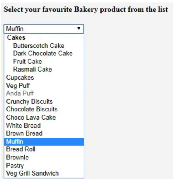

#### Выпадающие списки (мы будем использовать Thymeleaf)
* Что-бы создать выпадающий список в html есть 2 тега: `select`, `option`
* `select` создаём сам выпадающий список
* `option` указываем те значения которые можно выбрать

#### Приложение:
* Создадим дополнительно отдельный контроллер AdminController (для выбора администратора из списка людей)
  

